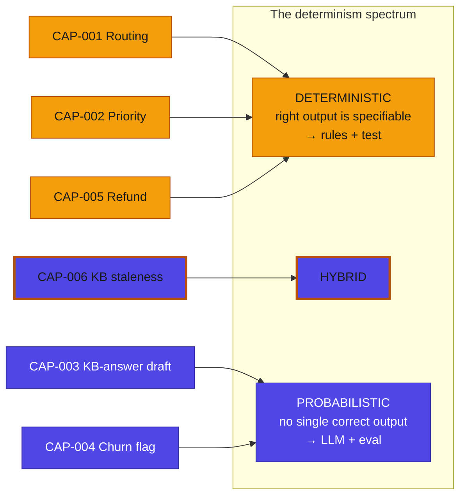

# Determinism-Fit Map — Aava automation portfolio

The signature decision of this engagement: each capability placed on the determinism spectrum, with the component and assurance model that fit. This is what the board mandate would have skipped — and what would have prevented the cautionary tale.

*Four capabilities sit at the deterministic/hybrid end (amber: rules + human); two are genuinely probabilistic (indigo: an LLM earns its place). The map is the architecture decision, made before building.*

## The placement table

| Fit ID | Capability | Determinism placement | Chosen approach | Assurance | Explainability | Autonomy | Rationale |
|---|---|---|---|---|---|---|---|
| `DFM-001` | Categorise & route a ticket (`CAP-001`) | deterministic | rules + dropdown fallback | test | the matched keyword/rule is shown on the ticket | n/a | the right queue is specifiable from keywords; an LLM here is an unexplainable black box that drifts and gets routed around |
| `DFM-002` | Set priority / SLA (`CAP-002`) | mostly deterministic | rules + flag edge cases | test | the SLA rule that fired is shown | n/a | priority follows the contract (tier + outage keyword); specifiable, so rules + test, not eval |
| `DFM-003` | Draft a first response / KB answer (`CAP-003`) | probabilistic | LLM, suggest-only | eval + guardrails | the KB source is cited; a human edits before sending | `L1` | there is no single correct wording; generation is genuine probabilistic value — the right place for an LLM |
| `DFM-004` | Flag a churn / dissatisfaction risk (`CAP-004`) | probabilistic, low-consequence | classifier, flags for review | eval-monitored | the signals behind the flag are surfaced | `L3` | sentiment is not specifiable; consequence is low (a human reviews every flag), so an agent may act-and-report |
| `DFM-005` | Decide a refund / credit (`CAP-005`) | deterministic policy + exceptions | rules + human-alone (out-of-policy) | test + human | the policy rule applied is shown; exceptions go to a named human | n/a | in-policy refunds are specifiable; out-of-policy is a human decision, never an LLM |
| `DFM-006` | Detect a stale KB article (`CAP-006`) | hybrid | rules (age/usage) detect; LLM suggests a review note | hybrid (test the trigger; eval the suggestion) | the age rule that flagged it is shown; the LLM note is a suggestion | `L0` | the *trigger* is specifiable (rules); only the *review suggestion* is generative — state which part is which |

**The boundary the map draws.** `DFM-006` is the instructive hybrid: the architecture does *not* hand the whole capability to an LLM. Rules decide *that* an article is stale (deterministic, tested); the LLM only drafts a suggested review note (probabilistic, suggest-only). Naming which part is which is what keeps a "hybrid" honest.

**What this prevents.** Read `DFM-001` against the cautionary tale: the peer company placed a probabilistic component on a deterministic capability. The map makes that a visible, reviewable decision — and the obvious one to reject.
