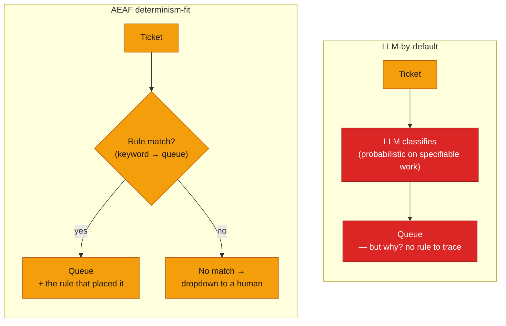
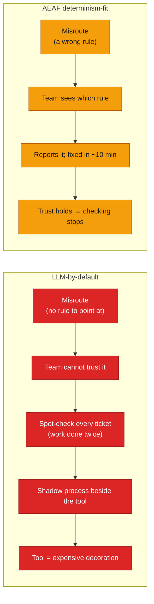

# The Default Trap

**In brief.** The reflex of the moment is to put an LLM in the middle of every workflow. For work whose right answer is *specifiable*, that reflex is an architecture error: it trades a transparent, testable rule for an unexplainable probability — a black box that passes the demo, drifts in production, and gets routed around by the very team it was built for. This document puts the two paths side by side on a real, widely-shared case (ticket routing) and shows how AEAF's determinism-fit decision (→ `artifacts/supporting/determinism-fit-map.md`) produces the better outcome with *less* AI.

> Colour in the diagrams: **amber** = deterministic (rules / human, explainable), **indigo** = probabilistic (LLM / agent), **red** = a category error or its consequence.

---

## 1. The case

A support team, ~15 people, ~90–100 tickets a day. Each ticket needs a category and a priority so it lands in the right queue. The obvious build: an LLM reads the ticket and classifies it. It demoed well. Then production happened.

| | LLM-by-default | AEAF determinism-fit |
|---|---|---|
| Approach | LLM classifies every ticket | ~30 rules + dropdown fallback; LLM only where generative |
| Accuracy | ~92% (≈ 7–8 misroutes/day) | ~99% |
| Why a ticket went where it did | "the model decided" — no rule to point at | the matched rule is shown on the ticket |
| Team behaviour | spot-checks every classification (work done twice) | trusts it; stops checking |
| Latency | 2–3 s per ticket | instant |
| API cost | ~$180 / month | $0 (rules run no model) |
| Net result | a black box people route around | a tool people rely on |

## 2. The same capability, two architectures



*Left: a probabilistic component placed on specifiable work — the right output exists and is derivable from keywords, but the architecture hid it behind a model that cannot explain itself. Right: the spectrum-correct placement — rules decide and show their work, a human handles the genuine no-match. Same capability, opposite trust outcome.*

## 3. Why the black box collapses — the shadow-process dynamic

The failure is not the 8% error. It is that the error is *unexplainable*, which destroys trust, which produces a parallel human process that does the work again.



*Explainability is not cosmetic. A traceable wrong answer is fixable and keeps trust; an untraceable wrong answer spawns a shadow process. The determinism-fit placement is what makes the answer traceable.*

## 4. Coverage of what actually matters

```vega-lite
{
  "$schema": "https://vega.github.io/schema/vega-lite/v5.json",
  "description": "LLM-by-default vs AEAF determinism-fit on the ticket-routing capability",
  "data": {"values": [
    {"factor": "Accuracy", "approach": "LLM-by-default", "score": 92},
    {"factor": "Accuracy", "approach": "AEAF determinism-fit", "score": 99},
    {"factor": "Explainability", "approach": "LLM-by-default", "score": 10},
    {"factor": "Explainability", "approach": "AEAF determinism-fit", "score": 100},
    {"factor": "Team trust", "approach": "LLM-by-default", "score": 20},
    {"factor": "Team trust", "approach": "AEAF determinism-fit", "score": 95},
    {"factor": "Fix speed", "approach": "LLM-by-default", "score": 25},
    {"factor": "Fix speed", "approach": "AEAF determinism-fit", "score": 95},
    {"factor": "Latency", "approach": "LLM-by-default", "score": 40},
    {"factor": "Latency", "approach": "AEAF determinism-fit", "score": 100},
    {"factor": "Cost efficiency", "approach": "LLM-by-default", "score": 30},
    {"factor": "Cost efficiency", "approach": "AEAF determinism-fit", "score": 100}
  ]},
  "mark": "bar",
  "encoding": {
    "y": {"field": "factor", "type": "nominal", "title": null, "sort": null},
    "x": {"field": "score", "type": "quantitative", "title": "Score", "scale": {"domain": [0, 100]}},
    "yOffset": {"field": "approach"},
    "color": {"field": "approach", "type": "nominal", "title": null, "scale": {"range": ["#DC2626", "#F59E0B"]}}
  }
}
```

*On the one axis where the LLM was supposed to win — accuracy — it lost (92 vs 99). On every other axis it was not even close. The model was solving a problem the capability did not have.*

## 5. The reframe AEAF forces

The mistake is not "we chose a bad model." It is "we never asked where this capability sits on the determinism spectrum." AEAF asks it at design time (→ `deliverables/architecture-vision.md`, `artifacts/supporting/determinism-fit-map.md`):

- **Is the right output specifiable?** If yes → rules + a test. The output is traceable and the assurance is pass/fail. (Routing, priority, in-policy refund.)
- **Is the value genuinely probabilistic?** If yes → an LLM + an eval, placed suggest-only so a human owns the consequence. (KB-answer drafting, churn flagging.)
- **Is it part each?** → a hybrid with the boundary named — rules for the specifiable part, an LLM only for the generative part. (KB-staleness.)

Aava's portfolio came out at **two agents of six capabilities.** The other four are rules and humans, by deliberate decision.

## 6. The conclusion

The right amount of AI is not the maximum amount. It is the amount the determinism spectrum justifies — and for a great deal of real work, the spectrum says *rules and a dropdown*, because the team can see why the system did what it did and therefore trusts it enough to stop checking. AEAF's contribution is not more AI; it is the discipline to place each capability correctly, to say *no* to a model where a model is the wrong tool, and *yes*, precisely, where it is the right one. Skip that decision and you ship expensive decoration. Make it, and you ship something people use.
