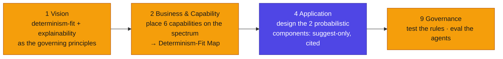

# Aava automation portfolio — AEAF method walkthrough

**In brief.** How Aava ran the early phases of the AEAF Method to decide *where AI belongs*. This example is vision-weighted: the decisive work is in Phase 1 (Vision), Phase 2 (capability allocation on the determinism spectrum), and Phase 4 (designing the probabilistic components for non-determinism). The runtime machinery is light, because most of the portfolio is rules — which need a test, not a runtime loop.

## Phase 1 — Vision: ask the determinism question first
Before any build, Aava fixed two principles (→ `artifacts/classical/principles-catalog.md`): **determinism-fit** (`P-1`) and **explainability** (`P-2`). These reframed the board's "automate with AI" mandate into "place each capability correctly." The Vision deliverable (→ `deliverables/architecture-vision.md`) secures the **decision rule** up front — AI is placed where probabilistic value justifies it, not by default — so no one later mistakes "less AI" for "less done." *How many* capabilities end up as rules versus agents is not decided here; that is the next phase's work.

## Phase 2 — Business & Capability: place each capability on the spectrum
The six candidate capabilities were decomposed and each placed on the determinism spectrum (→ `artifacts/supporting/determinism-fit-map.md`). The test applied to each: *is the right output specifiable?*
- **Yes → deterministic → rules + test.** Routing, priority, in-policy refund. The right queue follows from keywords; the priority follows from the SLA matrix; the refund follows from policy. An LLM here would replace a traceable rule with an unexplainable probability — the cautionary tale's exact mistake.
- **No → probabilistic → LLM + eval.** KB-answer drafting (no single correct wording) and churn flagging (sentiment is not specifiable).
- **Part each → hybrid, with the boundary named.** KB-staleness: rules decide *that* an article is stale; the LLM only drafts a review note.

The allocation and the requirement-vs-intent split fall straight out of the placement (→ `artifacts/classical/business-capability-catalog.md`, `requirements-intent-catalog.md`): a deterministic capability is written as a tested **requirement** (`REQ-*`); a probabilistic one as an evaluated **intent** (`INT-*`).

## Phase 4 — Application: design the probabilistic components for non-determinism
Only the two agentic capabilities needed non-determinism design. Both were built **suggest/flag-only**: the KB-Draft Agent proposes a cited draft a human edits and sends (`AG-001`, `L1`); the Churn-Flag Agent flags accounts a human reviews (`AG-002`, `L3`). Neither takes the consequential action. Explainability was designed in: a draft must cite its KB source or it is blocked (guardrail `G-2`, the runtime face of principle `P-2`).

## Phase 9 — Governance: test the rules, eval the agents
The governance is split by determinism placement, deliberately:
- The **rules** (routing, priority, refund) are **tested** — pass/fail acceptance on defined cases, including "every routed ticket cites the rule that placed it" (→ `requirements-intent-catalog.md`).
- The **agents** are **evaluated** — continuous eval suites with thresholds fixed before the run (→ `artifacts/new/eval-suite-specification.md`).

Applying continuous eval to the rules would waste effort on behaviour that cannot vary; putting the agents behind a one-time test would let them drift. Matching the assurance model to the placement is the whole discipline.

## What this case demonstrates
The customer-support example shows agentic done right. This one shows the decision that comes *before* any agent exists: whether a capability should be an agent at all. Deciding that deliberately — placing each capability on the spectrum rather than defaulting to an LLM — is what the architecture is for; Aava's Phase 2 allocation happens to land at two agents of six, but the discipline, not the number, is the point, and it is the decision the current rush to put an LLM on everything skips. The contrast with the just-do-it path is `the-default-trap.md`.
