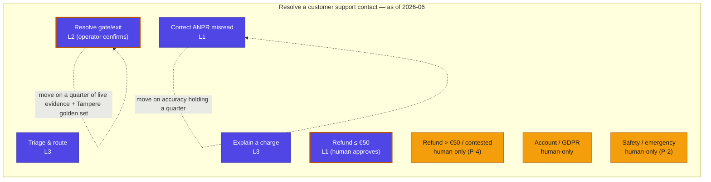

# Capability Automation-Frontier Map — Parkki Nordic support line

The boundary between human-performed and agent-performed work across the support capability, and where it is moving — a view over the allocations, as of **2026-06-03**.

| Capability leaf | As-of performer | Current autonomy | Projected next | Assurance precondition for the move | Trend |
|---|---|---|---|---|---|
| Triage & route (`CAP-001`) | Agent | `L3` | hold at L3 | — | → stable |
| Resolve gate/exit (`CAP-002`) | Agent (operator confirms) | `L2` | L3 | one quarter of live evidence; `G-1` holds; Tampere in golden set | → toward agent |
| Explain a charge (`CAP-003`) | Agent | `L3` | hold at L3 | — | → stable |
| Correct ANPR misread (`CAP-004`) | Agent | `L1` | L3 | correction accuracy holds a quarter | → toward agent |
| Refund ≤ €50 in policy (`CAP-007`) | Agent (human approves) | `L1` | hold at L1 | board keeps money in-the-loop | ⏸ held |
| Refund > €50 / contested (`CAP-007`) | **Human** | n/a | **stays human** | none — principle `P-4` | ⏹ fixed human |
| Account / GDPR (`CAP-005`) | **Human** | n/a | **stays human** | none — board appetite | ⏹ fixed human |
| Safety / emergency (`CAP-006`) | **Human** | n/a | **stays human** | none — principle `P-2` | ⏹ fixed human |

*Figure — the support-line frontier. Indigo leaves are agent-performed, amber leaves are human-performed, split nodes are hybrid (agent acts, human confirms). The three amber leaves are fixed human by board appetite and principle — first-class decisions, not gaps. The dotted self-loops are intended, gated moves: Gate-Ops L2→L3 and ANPR L1→L3, each firing only when its assurance precondition holds. This map is derived from the allocations and the Trust & Accountability Matrix — it is not authored by hand.*
