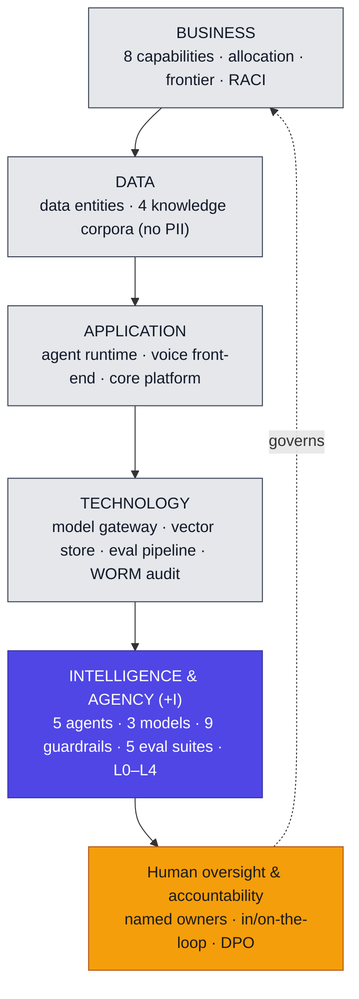

# Architecture Definition Document — Parkki Nordic agentic support line

**Deliverable (the headline board document).** The single composition of the whole target architecture across BDAT+I. It assembles the domain artifacts with a synthesis per layer; it does not re-author them — every claim traces to the artifact that holds the detail.

## Architecture overview

*One picture of the whole: the four classical domains carry the service; the +I domain carries the agents, models, guardrails, evals, and autonomy; human oversight and accountability wrap it.*

## Business
The capability model decomposed to the decision level, with performer mix and autonomy per leaf (→ `business-capability-catalog`); the responsibility/accountability split and decision bands (→ `human-agent-raci`); the actors and roles (→ `organization-actor-catalog`, `role-catalog`); and the frontier and its trajectory (→ `capability-automation-frontier-map`). Refunds split at the decision level; safety and account/GDPR fixed human.

## Data
Data entities with their classification and the `feedsCorpus` link (→ `data-entity-catalog`), and the four governed knowledge corpora with freshness, classification, and owner (→ `knowledge-corpus-catalog`). The load-bearing decision: **no customer PII enters a corpus** — policy is embedded, customer facts are read live.

## Application
The agent runtime, voice front-end, and core platform (→ `application-portfolio-catalog`), and the non-determinism design at the process level — bounded outputs, fallback, handoff, and "deny and escalate, never open on uncertainty" for the gate (→ `process-function-catalog`).

## Technology
The AI platform with its enforcement points named (→ `technology-portfolio-catalog`): the model gateway (PII egress, `G-3`), the orchestration runtime (pre-action guardrails), the eval pipeline, and the WORM audit store. The reasoning models as a right-sized portfolio (→ `model-portfolio`).

## Intelligence & Agency (+I)
The five agents with their bounded purposes (→ `agent-catalog`); the guardrails compiled from principles, with enforcement points and fail actions (→ `guardrail-policy-catalog`); the eval suites with thresholds fixed before the run (→ `eval-suite-specification`); the autonomy assignment against the canonical scale (→ `autonomy-level-classification`); and the live standing view of who is answerable now (→ `trust-accountability-matrix`).

## Key decisions
- `ADR-001` — Gate-Ops goes live at **L2, not L3** (physical action, no live evidence yet).
- `ADR-002` — EU AI Act classification: **limited-risk** (counsel-confirmed).

## Compliance & gaps
The EU obligations mapped to the controls that meet them (→ `regulatory-obligations-register`): GDPR (incl. Art 22 via the autonomy model), AI Act Art 50 transparency, ePrivacy consent. One open item — accessibility — tracked as partial. Baseline-to-target gaps and the sequence to close them are the Roadmap (→ `architecture-roadmap-migration-plan`).

## Sign-off
Architecture board, 2026-04-02. This ADD is the agreed target architecture; the design-time gate (per agent) authorises operation.
