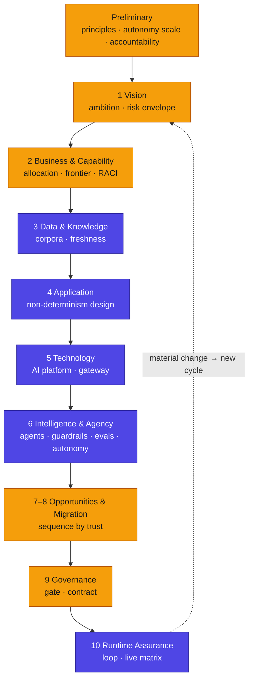

# Parkki Nordic support line — AEAF method walkthrough

**In brief.** This is the human-facing narrative: how the Parkki Nordic support line was taken through the AEAF Method, phase by phase, and *why* each decision was made. It is the answer to "what does it actually mean to design an agentic service on enterprise-architecture principles?" Read it alongside the filled artifacts — every claim here resolves to an artifact in this folder. The service was an existing PoC, so this is a **retrofit** (the `aeaf-retrofit` workflow): scan what was built, reverse-map it, gap-analyse against the gates, and produce the governed target state you see here.

---

## Phase P — Preliminary: set the rules before the agents

Before a single agent was designed, Parkki Nordic fixed three things (→ `artifacts/classical/principles-catalog.md`, `artifacts/new/autonomy-level-classification.md`):

- **Principles with an Enforcement attribute.** Seven principles, five of them `runtime` — because a probabilistic actor running money and a gate can violate a belief at machine speed, so the belief has to become a guardrail. "Customer PII never leaves the EU" is not advice to an engineer here; it is `P-1`, which *compiles into* `G-3`.
- **The autonomy scale.** The canonical L0–L4, adopted unchanged, with the board **capping the support line at L3** — no out-of-the-loop action, because every case touches money or a physical gate.
- **The accountability model.** Every capability gets exactly one named human owner; accountability never transfers to an agent. This is the rule the whole artifact set is later checked against.

The Preliminary phase also characterised the **regulatory exposure** — the service processes personal and payment data, makes semi-automated decisions, and records calls, so GDPR, the EU AI Act, ePrivacy, PSD2/consumer law, and the European Accessibility Act all bear on it. Those obligations were mapped onto the principles and guardrails that realise them (→ `artifacts/supporting/regulatory-obligations-register.md`), and the AI Act risk tier was classified and recorded with counsel as **limited-risk** (→ `decisions/ai-act-classification.md`). The elegant part: GDPR Art 22 (a human must be able to intervene in a significant automated decision) is satisfied by the autonomy model itself — the human-alone allocations and the in-the-loop gate *are* the human-intervention path; no bolt-on was needed.

*Why it matters: the just-do-it version skipped this entirely and discovered its principles — and its legal obligations — only after an incident. Here the principles exist before the agents, are enforceable by construction, and the EU obligations are traced to the controls that meet them.*

## Phase 1 — Vision: state the ambition and the risk envelope

The ambition: resolve routine, reversible support contacts in minutes with agents; keep sensitive, contested, and irreversible work with humans. The **risk envelope** the board set: agents may act on a physical gate and on refunds up to a cap, but never on safety, never on account/GDPR, never on large or contested money. That envelope is what later makes two capability leaves *fixed human* rather than candidates for automation (→ `00-case-context.md`, `artifacts/classical/requirements-intent-catalog.md`).

## Phase 2 — Business & Capability: the central design act

"Resolve a customer support contact" was decomposed to the level where each leaf has a single allocation — because the capability is not uniform: opening a gate for a paid driver and approving a contested €400 refund are opposite decisions (→ `artifacts/classical/business-capability-catalog.md`). For each leaf the team recorded who performs it, at what autonomy, under what oversight, and who is accountable (→ `artifacts/new/human-agent-raci.md`), and derived the frontier (→ `artifacts/new/capability-automation-frontier-map.md`).

The decisive moves here:
- **Refund split at the decision level** — ≤ €50 in-policy is agent-proposes-human-approves (`L1`); > €50 or contested is human-alone. One capability, two allocations.
- **Two leaves marked fixed-human** — safety (`CAP-006`) and account/GDPR (`CAP-005`) — as first-class decisions, drawn on the frontier map in amber, not left as gaps.

## Phase 3 — Data & Knowledge: the cognitive substrate, governed

Four knowledge corpora were defined — pricing, ANPR, payment/refund, escalation — each with a source, a freshness threshold, a classification, and an owner (→ `artifacts/new/knowledge-corpus-catalog.md`). The load-bearing decision: **no customer PII enters any corpus.** The corpora ground reasoning *about policy*; customer facts are fetched live by the read tools. The Data Entity Catalog makes this explicit — policy documents `feedsCorpus`, but the customer, session, and payment entities do not (→ `artifacts/classical/data-entity-catalog.md`). Each corpus's staleness threshold is wired to guardrail `G-7`, so a stale corpus *stops* the agent rather than letting it answer from old policy.

## Phase 4 — Application: design for non-determinism

The application was designed for the fact that the agent is probabilistic: every agent-touched step has a defined behaviour when the model fails or is unsure (→ `artifacts/classical/process-function-catalog.md`). For the consequential step — opening the gate (`PRC-004`) — that behaviour is **deny and escalate**, never "open on uncertainty." Bounded outputs, a human-handoff path, and a decision trail are designed in, not bolted on.

## Phase 5 — Technology: the AI platform and its enforcement points

The platform was specified with the **enforcement points named** (→ `artifacts/classical/technology-portfolio-catalog.md`): the model gateway (`TC-001`) enforces the PII-egress guardrail `G-3`; the orchestration runtime (`TC-007`) enforces the pre-action guardrails (`G-1`, `G-4`, `G-5`, `G-6`, `G-7`, `G-8`); the WORM audit store (`TC-008`) captures the decision trails and guardrail vetoes the assurance case later relies on. The three reasoning models were registered as a portfolio, right-sized to the job (→ `artifacts/new/model-portfolio.md`).

## Phase 6 — Intelligence & Agency: the agents as actors

This is where the agents are designed as first-class actors, not features (→ `artifacts/new/agent-catalog.md`). Five agents, each with a bounded purpose stated as an explicit "does not." The principles were **compiled into guardrails** with enforcement points and fail actions (→ `artifacts/new/guardrail-policy-catalog.md`): `P-5` "a physical action needs a paid session" → `G-1`, enforced pre-action, fail = block + escalate, proven by `EV-002`. Eval suites were built per agent with thresholds **fixed before any run** (→ `artifacts/new/eval-suite-specification.md`), and an autonomy level assigned per capability against the scale.

The agent design then passed an **independent pre-gate review** (the agentic architecture review) before going near the board.

## Phases 7–8 — Opportunities & Migration: sequence by trust

The rollout was sequenced by trust earned: triage and explanation (reversible) went to L3 first; the gate and ANPR correction started lower and were given a path to widen as assurance accrued. Each frontier move carries a **trigger and an assurance precondition** — Gate-Ops L2→L3 requires a quarter of live evidence and the Tampere garages in the golden set (→ `artifacts/new/capability-automation-frontier-map.md`).

## Phase 9 — Governance: the gate that actually gates

The board ran the design-time gate per agent (→ `checklists/design-time-gate.md` for `AG-002`). Every row cleared **with an evidence reference** — and one row was deliberately *not* cleared for the autonomy requested: L3 for Gate-Ops was withheld because the evidence covered Helsinki daytime only. The agent went live at **L2** under a signed contract (→ `decisions/architecture-contract.md`), with the reasoning recorded as an ADR (→ `decisions/agentic-adr.md`). This is the gate doing its job rather than rubber-stamping.

## Phase 10 — Change & Runtime Assurance: the loop that never stops

Once operating, the agents are governed *while they run*. The Trust & Accountability Matrix is a **living view**, refreshed by the loop, recording the current oversight mode, autonomy, live assurance, and residual risk per agent — including, honestly, that Gate-Ops has no L3 evidence yet and that Tampere is a known gap (→ `artifacts/new/trust-accountability-matrix.md`). Guardrails are enforced at decision points; evals run online watching distributions; the decision trail writes to the WORM store. A material change — a model swap, a new tool, a request to widen to L3, or a failed eval — sends the affected agent back through the gate, not the whole enterprise.

---

## What this case demonstrates

Every artifact here is filled, cross-linked, and machine-checked (`aeaf-validate` passes — see the README). The point is not the parking domain; it is that an agentic service can be **architected** — its quality, safety, and continuity made provable — at a cost the blended workforce can sustain. The contrast with the same service built just-do-it is the subject of `tools/example/the-drift/`.
