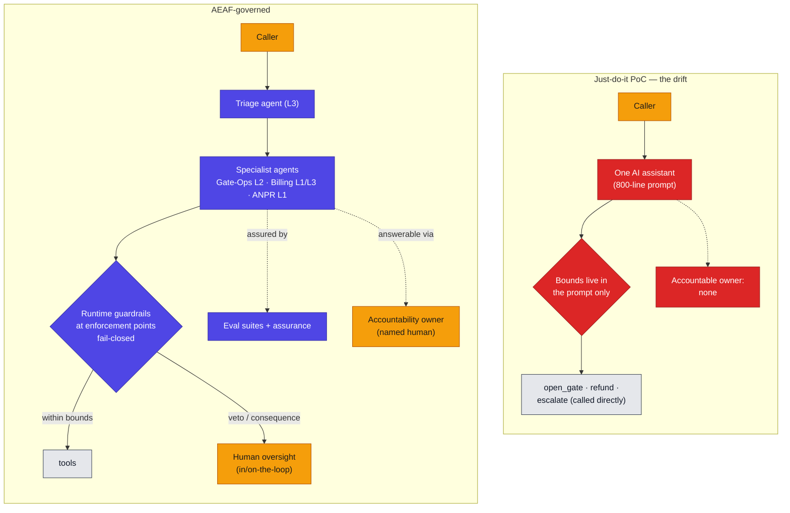
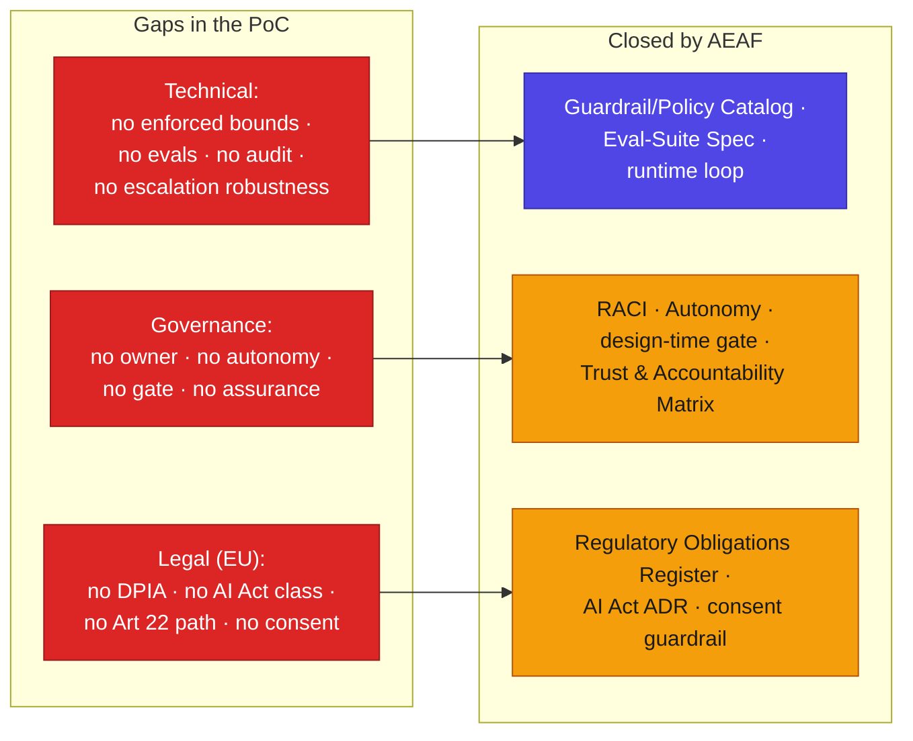

# The Drift

**In brief.** Two versions of the same agentic support line exist. One was built just-do-it — a working voice agent on a model, telephony, and a handful of tools, demoed in two weeks. The other is the same service taken through AEAF (`../customer-support/`). They look almost identical in a demo. They are not the same thing. This document puts them side by side, reverse-maps the just-do-it version into AEAF's own terms to show what is missing, and follows what happens to each in production. The conclusion is not a matter of taste: without controlled, systematic enterprise architecture, an agentic service that touches money, personal data, and a physical action is **a collapsing proof-of-concept, not a business** — and in the EU it may not even be lawful to operate.

> Colour in the diagrams: **indigo** = governed machine intelligence, **amber** = human judgment, **red** = ungoverned or missing. The red is the drift.

---

## 1. The two services at a glance

Both answer the phone, understand the caller, call the same tools, and resolve the routine cases. The difference is everything you cannot see in a demo.

| Dimension | Just-do-it PoC ("the drift") | AEAF-governed (`../customer-support/`) |
|---|---|---|
| The agent | One "AI assistant" with an 800-line system prompt | Five bounded agent actors, each with a stated purpose and an explicit *not* (`agent-catalog`) |
| Bounds on behaviour | Instructions in the prompt | Runtime guardrails at named enforcement points, fail-closed (`guardrail-policy-catalog`) |
| Autonomy | Undeclared — acts in production with no graded controls | Graded L0–L4, assigned per capability, earned on evidence (`autonomy-level-classification`) |
| Who is accountable | Nobody named | One named human per capability (`human-agent-raci`, `trust-accountability-matrix`) |
| How you know it works | It worked in the demo | Continuous eval suites with thresholds fixed before the run (`eval-suite-specification`) |
| When it drifts | You find out from a complaint | The online evals catch the distribution shift; the agent is contained |
| Personal data | 7-day audit TTL, no retention/erasure design | Minimisation, retention, no PII in corpora, DSAR path (`P-1`, `P-9`, register) |
| EU law | Unaddressed | GDPR, AI Act, ePrivacy mapped to controls (`regulatory-obligations-register`) |
| Change | Edit the prompt, redeploy | Material change re-opens the gate (`re-gating-trigger`) |

## 2. The same service, two architectures



*Left: one undifferentiated agent whose only bounds are words in a prompt the model can talk past, calling consequential tools directly, with no one accountable. Right: bounded agents, guardrails enforced at real points that fail closed, human judgment on the consequential path, evidence that it behaves, and a named human who answers. The demo cannot tell them apart. Production can.*

## 3. The PoC, reverse-mapped into AEAF

Run the `aeaf-retrofit` scan over the just-do-it version and write down what is actually there. The exercise is brutal precisely because it uses the service's own reality:

| AEAF artifact | What the reverse-map finds in the PoC |
|---|---|
| Agent Catalog | One row, no bounded purpose, no autonomy, no owner — "a general assistant" |
| Guardrail/Policy Catalog | Empty. The "rules" are prompt sentences → **advisory, not guardrails** (the model can be argued past them) |
| Autonomy-Level Classification | None. The agent opens a gate and stages refunds in production with **no graded controls** — de-facto high autonomy, ungoverned |
| Eval-Suite Specification | None. "It worked in the demo" is the entire assurance |
| Human-Agent RACI | None. No decision-authority bands; the agent acts alone wherever the prompt lets it |
| Trust & Accountability Matrix | None. No named owner, no live evidence, no residual-risk record |
| Knowledge-Corpus Catalog | KB files exist but ungoverned — no freshness rule, classification, or owner |
| Regulatory Obligations Register | None. No DPIA, no AI Act classification, no Art 22 path, no consent enforcement, no processor DPA |

The reverse-map is the finding: the PoC is not "an early-stage AEAF service." It is a service with **the entire governance layer absent** — which is invisible in a demo and decisive in production.

## 4. The gap register — and what closes each gap

The full register is `gap-register.md`. Grouped, the gaps fall into three kinds, each closed by a specific AEAF artifact or gate:



## 5. Coverage, measured

The same concerns, scored for each version. The PoC is not "80% there with some polish left" — it is near-zero on every concern that does not show in a demo.

```vega-lite
{
  "$schema": "https://vega.github.io/schema/vega-lite/v5.json",
  "description": "Concern coverage: just-do-it PoC vs AEAF-governed",
  "data": {"values": [
    {"concern": "Enforced guardrails", "version": "Just-do-it PoC", "coverage": 10},
    {"concern": "Enforced guardrails", "version": "AEAF-governed", "coverage": 95},
    {"concern": "Agent evaluation", "version": "Just-do-it PoC", "coverage": 0},
    {"concern": "Agent evaluation", "version": "AEAF-governed", "coverage": 90},
    {"concern": "Accountability", "version": "Just-do-it PoC", "coverage": 0},
    {"concern": "Accountability", "version": "AEAF-governed", "coverage": 100},
    {"concern": "Autonomy control", "version": "Just-do-it PoC", "coverage": 5},
    {"concern": "Autonomy control", "version": "AEAF-governed", "coverage": 95},
    {"concern": "Audit / observability", "version": "Just-do-it PoC", "coverage": 20},
    {"concern": "Audit / observability", "version": "AEAF-governed", "coverage": 90},
    {"concern": "Escalation robustness", "version": "Just-do-it PoC", "coverage": 25},
    {"concern": "Escalation robustness", "version": "AEAF-governed", "coverage": 90},
    {"concern": "Data protection (GDPR)", "version": "Just-do-it PoC", "coverage": 15},
    {"concern": "Data protection (GDPR)", "version": "AEAF-governed", "coverage": 90},
    {"concern": "EU AI Act readiness", "version": "Just-do-it PoC", "coverage": 0},
    {"concern": "EU AI Act readiness", "version": "AEAF-governed", "coverage": 85},
    {"concern": "Continuity / SLA", "version": "Just-do-it PoC", "coverage": 10},
    {"concern": "Continuity / SLA", "version": "AEAF-governed", "coverage": 80}
  ]},
  "mark": "bar",
  "encoding": {
    "y": {"field": "concern", "type": "nominal", "title": null, "sort": null},
    "x": {"field": "coverage", "type": "quantitative", "title": "Coverage (%)", "scale": {"domain": [0, 100]}},
    "yOffset": {"field": "version"},
    "color": {"field": "version", "type": "nominal", "title": null, "scale": {"range": ["#DC2626", "#4F46E5"]}}
  }
}
```

*The shape of the chart is the argument: the gap is not a finishing sprint, it is the whole governance half of the system.*

## 6. The collapse dynamic

A PoC does not fail at the demo — it passes. It fails later, quietly, and the absence of governance is what turns a normal failure into a collapse.

```mermaid
flowchart TB
    classDef gap fill:#DC2626,stroke:#991B1B,color:#ffffff;
    classDef agent fill:#4F46E5,stroke:#3730A3,color:#ffffff;
    classDef human fill:#F59E0B,stroke:#B45309,color:#1a1a1a;

    subgraph D["Just-do-it path"]
        d1["Great demo"]:::agent --> d2["Ship to production"]:::agent
        d2 --> d3["Model/prompt/data drift<br/>(nothing watches)"]:::gap
        d3 --> d4["Wrong gate opened /<br/>over-refund / mishandled PII"]:::gap
        d4 --> d5["No eval saw it ·<br/>no owner answers ·<br/>no audit trail to reconstruct"]:::gap
        d5 --> d6["Trust lost ·<br/>possibly unlawful ·<br/>service pulled"]:::gap
    end

    subgraph G["AEAF-governed path"]
        g1["Design-time gate"]:::human --> g2["Operate at granted autonomy"]:::agent
        g2 --> g3["Online evals watch distributions"]:::agent
        g3 --> g4["Drift detected · agent contained<br/>(auto step-down)"]:::agent
        g4 --> g5["Owner notified · audit trail intact ·<br/>assurance case re-reviewed"]:::human
        g5 --> g2
    end
```



*Same drift event, two outcomes. On the left it is discovered by a customer and cannot be reconstructed. On the right an eval watching distributions catches it, the guardrail contains it, the named owner is notified, and the WORM audit trail explains it. The difference is not luck; it is the governance layer the PoC never had.*

## 7. The EU-legal axis: not just lower quality — possibly unlawful

For a service that processes personal and payment data and assists decisions on money, the missing governance is also missing **legal standing**:

| EU obligation | The PoC | Consequence |
|---|---|---|
| GDPR Art 35 — DPIA before high-risk processing | none | processing without a required assessment |
| GDPR Art 22 — human intervention in significant automated decisions | agent acts alone | no lawful intervention path |
| GDPR Art 28 — processor agreement with the model vendor | none | personal data to a processor without a DPA |
| GDPR Art 5 — retention / minimisation | 7-day TTL, no policy | undefined retention; PII risk |
| EU AI Act Art 50 — tell the user it is an AI | not enforced | transparency breach |
| ePrivacy — consent to record the call | none | recording without consent |

The AEAF version closes every one of these by construction (`regulatory-obligations-register`, `ai-act-classification`, `P-8`/`P-9`/`P-10`, `G-9`). The point is sharp: in the EU, the ungoverned PoC is not a faster route to the same destination — it is a route to a service you **cannot lawfully run**.

## 8. "But AEAF is too heavy" — answered

The historical objection to this kind of architecture is cost: it was too heavy to produce and maintain by hand. That objection is now wrong, for one reason. The artifacts on the governed side were authored and are kept current by agents, in plain Markdown, checked by a deterministic linter in milliseconds (`../../validate/`). The expensive part — the upkeep that defeated classical EA — is no longer a person's job. So the real comparison is not "cheap PoC vs expensive architecture." It is **a cheap PoC with an uncosted incident waiting, vs a now-cheap architecture that prevents it.** The drift's hidden cost is the collapse; the governed version's cost is a maintained Markdown repository.

## 9. The conclusion

Amid the hype, the unglamorous truth holds: an agentic service that touches money, data, and the physical world becomes a *business* only when its quality, safety, and continuity are made provable — its agents bounded, its autonomy earned, its decisions accountable, its behaviour evaluated, its obligations met — and kept current at a cost the blended workforce can sustain. That is what controlled, systematic enterprise architecture is. Without it, what you have is the drift: a service that demos beautifully and collapses the first time reality differs from the demo. With it, you have something you can run, defend to a board, and answer to a regulator. The two are not points on the same line. They are different things wearing the same demo.
