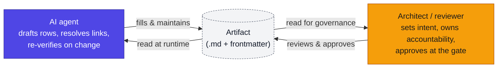

# The AEAF Artifact Processing Model

**In brief.** Classical enterprise architecture kept its catalogs, matrices, and maps in spreadsheets. That choice is a large part of why TOGAF earned its reputation as too heavy to sustain: a spreadsheet is expensive for a human to keep current and almost impossible for a machine to read, write, or verify. AEAF artifacts are read at runtime by agents and maintained continuously, so the format must serve both a human author and a machine author equally. This document records the decision: **every AEAF artifact is a Markdown file with a YAML frontmatter header.** It states why that format wins over a spreadsheet and over a pure-data format, and how the choice answers the standing critique of TOGAF.

---

## 1. The problem with the spreadsheet

The critique of TOGAF — "the content is sound but nobody implements it" — is largely an **execution-cost** critique, not a content critique. The frameworks were heavy because a human maintained the artifacts by hand in Excel, and a spreadsheet has four properties that make that maintenance expensive and the result un-agentic:

| Property of the spreadsheet | Consequence |
|---|---|
| Binary, not diff-able | No line-by-line review; no version history a human or agent can read; merges are manual. |
| Presentation fused to data | Layout, colour, and merged cells carry meaning a parser cannot recover reliably. |
| Weak cross-references | A link between two sheets is a fragile cell reference or a copied value; the web of artifacts (→ Book 2 §15.11) silently rots. |
| Not machine-writable at runtime | An agent cannot safely read or update a `.xlsx` as part of a runtime loop; the artifact stays a human-only document. |

When the artifact is expensive to keep current, it goes stale; when it goes stale, the architecture stops being trusted; when it stops being trusted, the framework is abandoned. The cost of upkeep, not the content, is what defeated adoption.

## 2. What changed: agents collapse the maintenance cost

Agents change the economics. A catalog that was expensive for a human to keep current is cheap for an agent to generate, cross-link, and re-verify on every change — *if* the format is one an agent can read and write. This is the move AEAF's tooling makes: keep TOGAF's sound content (the catalogs, matrices, maps), and put it in a format the blended workforce can both maintain. The format must satisfy three readers at once (→ Style Guide §1): the working architect, the governance reviewer, and the agent consuming the artifact at runtime.

## 3. The decision: Markdown + YAML frontmatter

**Every AEAF artifact is one `.md` file: a YAML frontmatter header for structured metadata, a Markdown body for the catalog/matrix/map/worksheet.** The schema is fixed in `conventions.md`.

```yaml
---
artifact: agent-catalog
phase: 6
domain: [I]
status: baseline
owner: "Head of Service Ops"
links: [model-portfolio, guardrail-policy-catalog, eval-suite-specification]
---
```
```markdown
# Agent Catalog
| Agent | Purpose | Model | Guardrails | Autonomy | Accountable |
|-------|---------|-------|-----------|----------|-------------|
| AG-001 | ...    | M-002 | G-1…G-5   | L1       | J. Virtanen |
```

The frontmatter is the structured layer a machine reads first (what this is, which phase, who owns it, what it links to); the body is the human-readable catalog. One file carries both.

## 4. Why this format, against the alternatives

Three candidate formats were weighed: the spreadsheet, a pure-data format (YAML/JSON as the source of truth with a generated view), and Markdown + frontmatter. The pure-data format is the most machine-rigorous but pushes humans to edit data files rather than prose, which loses the reviewer and the author. The spreadsheet loses the machine. Markdown + frontmatter is the only option that serves all three readers.

| Need | Spreadsheet | Pure data (YAML/JSON + generated view) | **Markdown + frontmatter** |
|---|---|---|---|
| Human reads it directly | ✓ | ✗ (reads the generated view, edits the source) | ✓ |
| Human edits it without tooling | partial | ✗ | ✓ |
| Agent reads/writes it at runtime | ✗ | ✓ | ✓ (frontmatter structured; tables parse) |
| Line-by-line diff & review (git) | ✗ | ✓ | ✓ |
| Cross-artifact links that resolve | weak | ✓ | ✓ (IDs in frontmatter `links` + body) |
| Renders to branded A4 PDF | export | needs a renderer | ✓ (same pipeline as the books) |
| One source of truth (no data/view split) | ✓ | ✗ (source ≠ view) | ✓ |

Markdown + frontmatter wins because it is the single format where the data and the human-readable view are the *same artifact*, it diffs and reviews in git, an agent can read the frontmatter and write the tables, and it renders to the same Futify-branded PDF pipeline the AEAF books already use.

### 4.1 And the EA repository tools?

A reader who runs a commercial EA repository or modelling suite — LeanIX, Ardoq, BiZZdesign, MEGA HOPEX, Sparx, ServiceNow APM, and their peers — will ask where this format sits relative to their tool. It is **not a competitor to them.** Those tools solve a real problem: a governed, queryable repository with impact analysis, dashboards, and modelled views. AEAF's format is the **tool-agnostic source layer underneath** that capability, not a replacement for it.

The relationship is one-way and native. Markdown + frontmatter is plain, structured text; an EA repository ingests it through the same path it already uses for CSV/structured import or its API, and the modelled views, dashboards, and impact analysis are then generated from it. What the format adds that a proprietary repository cannot is that the same artifact is *also* git-diffable, human-editable without the tool, agent-writable at runtime, and portable if you ever leave the vendor.

This avoids the second adoption trap, the mirror of the spreadsheet's. Architecture kept only inside a proprietary database is architecture an agent cannot read at runtime, a reviewer cannot diff line by line, and an enterprise cannot take with it. Keep the EA tool if you have one — point it at these artifacts as the canonical source it syncs from, rather than locking the architecture inside it.

## 5. How humans and agents share the artifact

The format is the contract between the two kinds of author. The division of labour the tooling assumes:



*The agent does the upkeep that defeated TOGAF — drafting catalog rows, resolving cross-references, re-running the artifact against its links when something changes. The human keeps what only a human can hold: the intent, the accountability, and the approval at the gate. The artifact is read back by both — by the agent at runtime (guardrails, autonomy levels, intent records are consumed by the running system) and by the reviewer at the gate.*

The instruction files at the root of this folder make the division operational: `CLAUDE.md` / `AGENTS.md` tell an agent how to fill and maintain an artifact; `README.md` orients a human; `llms.txt` is the machine index an agent uses to find the right template fast.

## 6. What this buys

- **The artifact stays current**, because the expensive part of upkeep is now an agent's job, not a person's evening.
- **The architecture stays trustworthy**, because a current artifact is one people act on.
- **The framework stays implemented**, because the cost that defeated adoption is gone. This is the whole point: AEAF's content was never the problem; the cost of keeping it alive was. Markdown + frontmatter, maintained by the blended workforce, is how the content finally gets kept.
