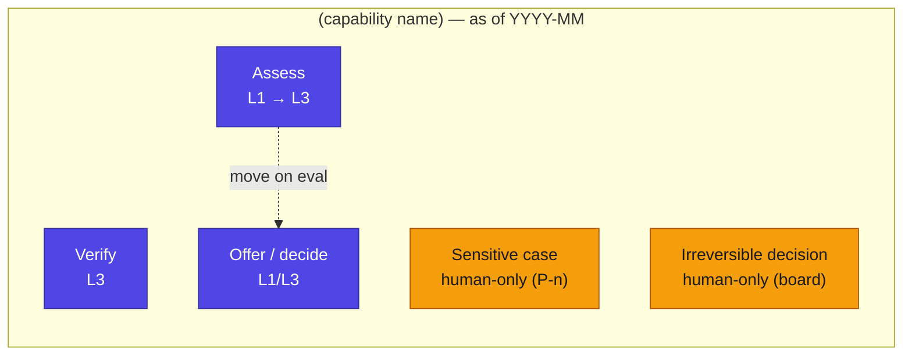

# Capability Automation-Frontier Map

**What it is.** The derived, time-versioned view of where the boundary between human-performed and agent-performed work sits across the capability map, and which way it is moving. It is **not a primary record** — it is a *view computed over the capability allocations* — and it is what strategy and the board read to see the state and trajectory of the blended workforce at a glance. A frontier *moves*; describe its position and trajectory, not a fixed split. Mark the leaves that **stay human on purpose** as first-class decisions, not gaps.
**Produced in.** Phase 2 · Business & Capability, re-derived whenever allocations change; frontier *moves* are planned in Phase 8.
**Instantiates.** `Automation Frontier`, a view over `Capability Allocation`s.
**Defined in.** Book 1 §21.4.9 · templated in Book 2 §15.10.

## Template — matrix form (one capability leaf per row)

| Capability leaf | As-of performer | Current autonomy | Projected next | Assurance precondition for the move | Trend |
|---|---|---|---|---|---|
<!-- example -->
| *(verify step)* | Agent | `L3` | hold at L3 | — | → stable |
| *(assess step)* | Agent (was hybrid) | `L1` | L3 | *(eval clears a quarter)* | → toward agent |
| *(decide/offer step)* | Agent | `L1`/`L3` | L3 (full) | *(edge cohort re-gated)* | → toward agent, paused |
| *(sensitive case)* | **Human** | n/a | **stays human** | none — principle `P-n` | ⏹ fixed human |
| *(irreversible decision)* | **Human** | n/a | **stays human** | none — board appetite | ⏹ fixed human |

## Diagram form

Colour by performer: **amber = human-performed, indigo = agent-performed, split = hybrid**; dotted arrows = intended, gated moves (not yet authorised). Stamp the as-of date.

## Common mistakes (→ Book 2 §15.10)

- **Authoring it as a plan instead of deriving it.** The map is a *view* over the allocation register and the Trust & Accountability Matrix. Maintained by hand independently, it drifts into a wish-list.
- **No as-of date.** The whole point is position *and* movement over time. Stamp every render.
- **Showing only the moves toward the agent.** Mark the leaves that *stay human on purpose* as first-class — they are decisions, not gaps.
- **Treating a gated/intended move as authorised.** Dotted arrows are intentions with preconditions; a solid frontier change happens only when the assurance precondition holds and the gate approves.
