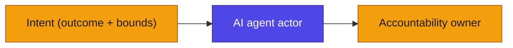

# AEAF Template Conventions

**In brief.** Every AEAF artifact is one Markdown file with a YAML frontmatter header and a Markdown body. The frontmatter carries the metadata an agent and a reviewer read first — what this is, which phase produced it, who owns it, what it links to. The body carries the catalog, matrix, map, or worksheet as Markdown tables and prose. This file fixes the shared schema so every template is filled the same way and every cross-reference resolves. It is the single source of truth for frontmatter fields, ID prefixes, the status lifecycle, and the diagram/colour rules. The editorial rules it points to (lexicon, anti-slop, readability) are binding from the AEAF Style Guide (in the published AEAF books).

---

## 1. The frontmatter schema

Every artifact file opens with a YAML frontmatter block. Fill every field that applies; mark a field you cannot yet answer `TBD` rather than deleting it — a missing field hides a question.

| Field | Required | Values | Notes |
|---|---|---|---|
| `artifact` | yes | slug, e.g. `agent-catalog` | The artifact's stable slug; matches the filename. |
| `title` | yes | text | Human-readable title. |
| `type` | yes | `catalog` / `matrix` / `map` / `spec` / `diagram` / `worksheet` / `decision` / `checklist` / `deliverable` / `reference` | The artifact shape (→ Book 1 §21.1). A `deliverable` is a packaged, signed work product that *assembles* artifacts (→ `deliverables/`). |
| `phase` | yes | `P` / `1`…`10` | The AEAF Method phase that produces it. |
| `domain` | yes | one or more of `B` `D` `A` `T` `I` | BDAT+I domain(s) it sits in. |
| `status` | yes | see §3 | Lifecycle state of the artifact. |
| `owner` | yes | named human/role | Answerable for this artifact's **currency and accuracy**. Never a team ("Collections" is not an owner; "Collections Ops Lead" is). |
| `accountable` | where the artifact carries accountability | named human/role | The accountability owner. **Never an agent.** |
| `as_of` | for living views (status `runtime`) | `YYYY-MM-DD` | Stamp every render of a derived/standing view (artifacts 8, 9). |
| `version` | yes | `MAJOR.MINOR` | Bump MINOR on content change, MAJOR on structural change. |
| `links` | yes | list of artifact slugs / entity IDs | The cross-references that make the set an architecture, not nine lists. **Never drop these** (→ Book 2 §15.1). |

Example header:

```yaml
---
artifact: agent-catalog
title: Agent Catalog
type: catalog
phase: 6
domain: [I]
status: baseline
owner: "Head of Service Ops"
accountable: "Head of Service Ops"
as_of: 2026-06-03
version: 1.0
links: [model-portfolio, knowledge-corpus-catalog, guardrail-policy-catalog, autonomy-level-classification, eval-suite-specification, trust-accountability-matrix]
---
```

## 2. The ID scheme

Entities inside artifacts carry stable IDs so a reference in one artifact resolves in another. Never reuse an ID after retirement. The prefixes below are canonical (the book's worked examples use `AG-`, `M-`, `KC-`, `G-`, `EV-`, `P-`).

| Prefix | Entity | Home artifact |
|---|---|---|
| `AG-nnn` | Agent actor | Agent Catalog |
| `M-nnn` | Model | Model Portfolio |
| `KC-nnn` | Knowledge corpus | Knowledge-Corpus Catalog |
| `G-n` | Guardrail | Guardrail/Policy Catalog |
| `EV-nnn` | Eval suite | Eval-Suite Specification |
| `L0`…`L4` | Autonomy level | Autonomy-Level Classification (canonical scale, → Book 1 §4) |
| `P-n` | Principle | Principles Catalog |
| `CAP-nnn` | Capability | Business Capability Catalog |
| `ACT-nnn` | Actor (human/agent/hybrid) | Organization / Actor Catalog |
| `ROLE-nnn` | Role | Role Catalog |
| `APP-nnn` | Application component | Application Portfolio Catalog |
| `DE-nnn` | Data entity | Data Entity Catalog |
| `TC-nnn` | Technology component | Technology Portfolio Catalog |
| `INT-nnn` | Intent record | Requirements & Intent Catalog |
| `AC-nnn` | Assurance case | Assurance Case |
| `ADR-nnn` | Architecture decision record | Agentic ADR |
| `CON-nnn` | Agentic architecture contract | Architecture Contract |

**The dangling-reference rule.** If an ID does not resolve — a guardrail with no agent, a model with no back-link, an autonomy level with no eval — that dangle is the next thing to fix. It marks a place the architecture cannot answer a question it will be asked (→ Book 2 §15.11).

## 3. The status lifecycle

`status` records where the **artifact** is in its life. Keep it distinct from an agent's runtime lifecycle state (`proposed / gated / operating / contained / retired`), which is a column **inside** the Agent Catalog.

| Status | Meaning |
|---|---|
| `stub` | Created, not yet filled. Headings present, rows empty/TBD. |
| `baseline` | Records the current ("as-is") state. |
| `target` | Records the intended ("to-be") state. |
| `approved` | Signed off at a gate; the agreed reference. |
| `runtime` | A living, continuously-refreshed view (Trust & Accountability Matrix; Automation-Frontier Map). Carries an `as_of` date and is never "filed once". |
| `retired` | Superseded; kept for audit, not current. |

## 4. Diagrams, colour, and tables

These follow the binding AEAF Style Guide, §4 (diagram & table conventions). The key rules for templates:

- **Mermaid only** for diagrams (never ASCII). **Vega-Lite** for quantitative charts (distributions, trends). Tables for any set of ≥3 parallel items or ≥3 numbers.
- **The indigo/amber colour convention is binding.** Indigo = machine / agent intelligence (agents, models, guardrails, evals, autonomous nodes). Amber = human judgment (human actors, accountability owners, approval, oversight). Hybrid = both. Copy this `classDef` block into every AEAF diagram:



> Note — the style guide's binding tokens are indigo `#4F46E5` and amber `#F59E0B`. Some rendered book-chapter diagrams use a darker amber `#C8860D` for contrast on white; either reads correctly, but templates standardise on the style-guide tokens above.

- **Caption every figure and table** with what the reader should take from it, and reference it from the body. A figure no sentence points to is removed.

## 5. Editorial rules (binding, from the Style Guide)

- **Locked lexicon** — use AEAF terms exactly (`guardrail`, `eval`, `agent actor`, `blended workforce`, `intent`, `capability allocation`, oversight modes `in-/on-/out-of-the-loop`). Do not coin synonyms. Never "bot", "digital worker", "the AI", "the LLM" in formal text (→ Style Guide §2).
- **Anti-AI-slop ban list** applies to every word of every artifact (→ Style Guide §5). No "leverage", "robust", "seamless", "game-changer", "navigate the complexities", hollow tricolons, throat-clearing openers.
- **Readability** — one claim per sentence; ~25-word sentence soft cap; ~3–4 sentence paragraph soft cap; carry weight in tables, not prose.
- **TOGAF** — AEAF is independent and original, not a TOGAF derivative or profile, and not endorsed by The Open Group. Phase-to-ADM parallels are a migration aid only (→ Style Guide §6).

## 6. The tailoring rule

A template is a checklist of what the meta-model says the artifact must record — not a contract. You may drop a cosmetic column (mark `TBD`, keep the heading), add a column your domain/regulator needs, or rename a field to house language (keep the meta-model term in a glossary). You may **never** drop the column that carries the **accountability owner**, the **autonomy level**, or a **link to another artifact** — those three make the set traceable and the agent answerable (→ Book 2 §15.1).
